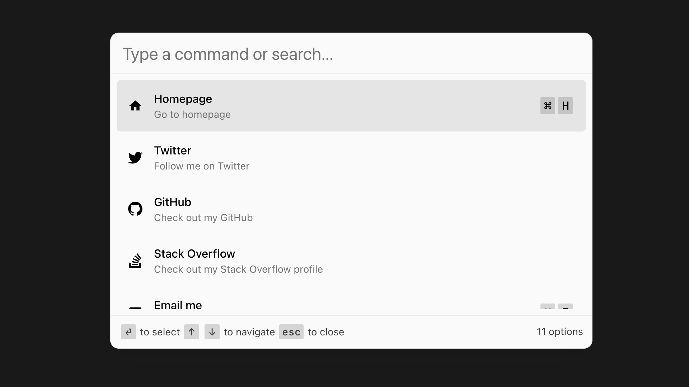
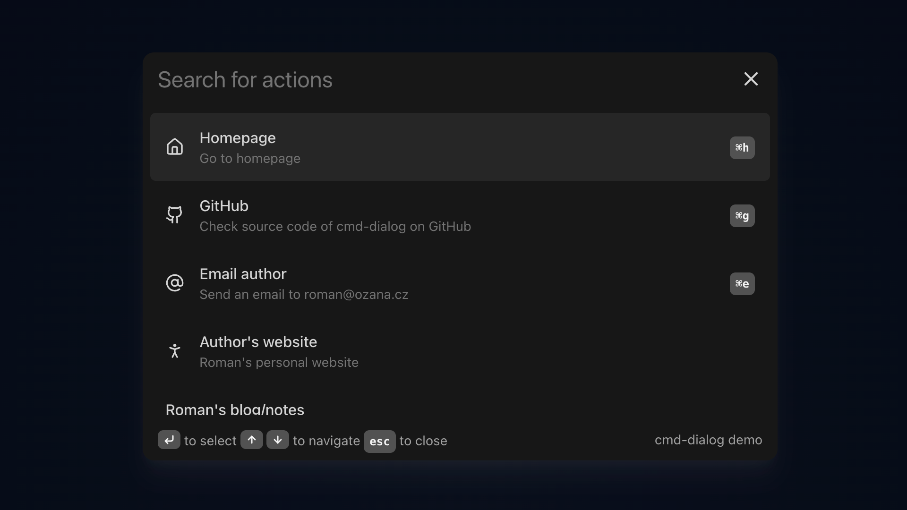

[](https://www.npmjs.com/package/cmd-dialog)
[](https://www.npmjs.com/package/cmd-dialog)
[](https://github.com/OzzyCzech/cmd-dialog/blob/main/LICENSE)
[](https://github.com/OzzyCzech/cmd-dialog/commit/main)
[](https://github.com/OzzyCzech/cmd-dialog/actions)

# cmd-dialog

A fast, keyboard-driven command dialog and shortcuts palette for web apps.




## Features

- Built-in dark/light themes
- Keyboard navigation
- Customizable action shortcuts with [tinykeys](https://github.com/jamiebuilds/tinykeys)
- Fuzzy search with [Fuse.js](https://fusejs.io/)
- Native `<dialog>` element
- Responsive design

## Installation

```shell
pnpm add cmd-dialog
```

Or from CDN:

```html
<script type="module" src="https://esm.sh/cmd-dialog"></script>
```

## Usage

```html
<cmd-dialog placeholder="Search..." hotkey="$mod+k"></cmd-dialog>

<script type="module">
	import "cmd-dialog";

	const dialog = document.querySelector("cmd-dialog");
	dialog.actions = [
		{
			title: "Author's website",
			description: "Roman's personal website",
			url: "https://ozana.cz",
			target: "_blank",
			tags: ["homepage", "contact", "email"],
		},
	];
</script>
```

See the [documentation](docs/readme.md) for details on attributes, events, and action configuration.

Try the [live demo](https://ozzyczech.github.io/cmd-dialog/).

## Dependencies

- [Lit](https://lit.dev/) — A simple base class for creating fast, lightweight web components.
- [Fuse.js](https://fusejs.io/) — Lightweight fuzzy-search library.
- [tinykeys](https://github.com/jamiebuilds/tinykeys) — A robust JavaScript library for capturing keyboard input.

## Credits

- Icons by [Lucide](https://lucide.dev) — licensed under the [ISC License](https://lucide.dev/license).
- Inspired by [Ninja Keys](https://github.com/ssleptsov/ninja-keys).

## License

[MIT](./LICENSE)

---

Made with ♥️ by [Roman Ožana](https://ozana.cz)
