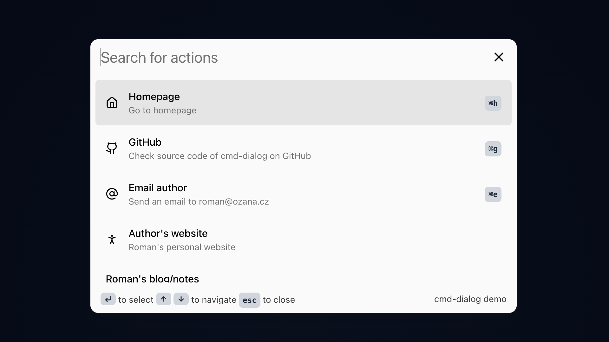

[](https://www.npmjs.com/package/cmd-dialog)
[](https://www.npmjs.com/package/cmd-dialog)
[](https://github.com/OzzyCzech/cmd-dialog/blob/main/LICENSE)
[](https://github.com/OzzyCzech/cmd-dialog/commit/main)
[](https://github.com/OzzyCzech/cmd-dialog/actions)

# Command `<dialog>`

Command dialog and keyboard shortcuts palette for web apps.



## Features

- Keyboard navigation
- Build in dark/light themes
- Customizable action shortcuts with [tinykeys](https://github.com/jamiebuilds/tinykeys)
- Native `<dialog>` element
- Responsive design
- Fuzzy search with [Fuse.js](https://fusejs.io/)

## Install

```shell
npm i cmd-dialog
```

```html
<!DOCTYPE html>
<html lang="en">
<head>
	<meta charset="UTF-8">
	<meta name="viewport" content="width=device-width, initial-scale=1.0">
	<title>Cmd Dialog Example</title>
</head>
<body>
<cmd-dialog/>
<script type="module" src="./main.js"></script>
</body>
```

```javascript
import { CmdDialog } from "cmd-dialog";

const dialog = document.querySelector('cmd-dialog');
dialog.actions = [
	{
		"title": "Author's website",
		"description": "Roman's personal website",
		"url": "https://ozana.cz",
		"target": "_blank",
		"tags": ["homepage", "contact", "email"]
	},
	// ...
];
```

See the [docs](docs/readme.md) for more details on how to use the `cmd-dialog` component.

### From CDN

Add the following `<script>` tag to your HTML file to use the `cmd-dialog` component from a CDN. Choose one of the
following options:

```html
<script type="module" src="https://esm.sh/cmd-dialog"></script>
```

### From ESM

```html
<script type="module">
  import CmdDialog from 'https://esm.sh/cmd-dialog';
</script>
```

## Dependencies

- [LitElement](https://lit.dev/) - A simple base class for creating fast, lightweight web components.
- [Fuse.js](https://fusejs.io/) - Lightweight fuzzy-search library.
- [tinykeys](https://github.com/jamiebuilds/tinykeys) - A robust Javascript library for capturing keyboard input.

## Credits

- Icons by [Lucide](https://lucide.dev) – licensed under the [ISC License](https://lucide.dev/license).
- The `cmd-dialog` is inspired by [Ninja Keys](https://github.com/ssleptsov/ninja-keys), which offers a similar command
  palette and keyboard shortcuts.

## License

[MIT](./LICENSE)